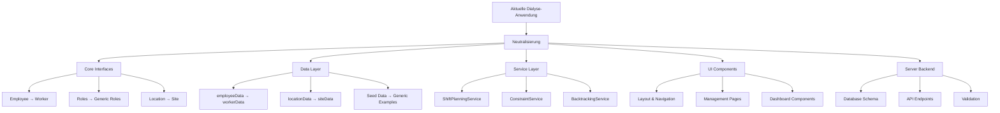

# Neutralisierungsplan: Dialyse-Anwendung → Allgemeine Schichtplanung

## Übersicht
Transformation der fachspezifischen Dialyse-Schichtplanungsanwendung zu einer generischen Schichtplanungs- und Personalzeitmanagement-Lösung.

## 1. Begriffstransformation

### Rollen & Personal
| **Aktuell (Medizin/Dialyse)** | **Neutral (Allgemein)** | **Kontext** |
|---|---|---|
| Pfleger | Fachkraft / Specialist | Qualifizierte Mitarbeiter |
| Pflegehelfer | Hilfskraft / Assistant | Unterstützende Mitarbeiter |
| Schichtleiter | Schichtleiter / Shift Leader | Führungsrolle bleibt |
| Gesundheits- und Krankenpfleger/in | Fachkraft | Rollenbeschreibung |

### Standorte & Organisationen
| **Aktuell** | **Neutral** | **Kontext** |
|---|---|---|
| Dialysepraxis | Standort / Location | Arbeitsplatz |
| Praxis | Standort / Betriebsstätte | Organisationseinheit |
| Klinik/clinic | Standort / Site | Arbeitsort |
| Elmshorn/Uetersen | Standort A/B | Beispiel-Standorte |

### Fachspezifische Begriffe
| **Aktuell** | **Neutral** | **Kontext** |
|---|---|---|
| Patient | Kunde / Client | Zu betreuende Person |
| Hämodialyse | Service A | Dienstleistungstyp |
| Peritonealdialyse | Service B | Dienstleistungstyp |
| Dialyse-Schulung | Fachschulung | Weiterbildung |

### Anwendung & Branding
| **Aktuell** | **Neutral** | **Kontext** |
|---|---|---|
| ShiftCare | WorkShift Manager | Anwendungsname |
| Dialysepraxis Schichtplanungssystem | Schichtplanungs- und Personalmanagement-System | Systemname |

## 2. Datenstruktur-Transformation

### Employee Interface
```typescript
// Vorher
interface Employee {
  clinic?: 'Elmshorn' | 'Uetersen';
  role: 'Pfleger' | 'Pflegehelfer' | 'Schichtleiter';
}

// Nachher
interface Employee {
  location?: string;
  role: 'Specialist' | 'Assistant' | 'ShiftLeader';
}
```

### Location Interface
```typescript
// Vorher
interface Location {
  specialties: string[]; // ['Hämodialyse', 'Peritonealdialyse']
  capacity: number; // Maximale Anzahl Patienten
}

// Nachher
interface Location {
  services: string[]; // Allgemeine Services
  capacity: number; // Arbeitsplätze/Kapazität
}
```

### LocationStats
```typescript
// Vorher
interface LocationStats {
  totalPatients: number;
  patientSatisfaction?: number;
}

// Nachher
interface LocationStats {
  totalClients: number;
  clientSatisfaction?: number;
}
```

## 3. Implementierungsstrategie

### Phase 1: Core-Transformation
1. **Core-Interfaces neutralisieren** (`src/models/interfaces.ts`)
2. **Server-Interfaces anpassen** (`server/src/types/interfaces.ts`)
3. **Datenmodelle generisch machen** (`src/data/`)

### Phase 2: Service-Layer
1. **Schichtplanungsservices** - Fachbereichsneutrale Logik
2. **Constraint-Services** - Generische Regeln
3. **Backtracking-Services** - Algorithmus-Neutralisierung

### Phase 3: UI-Transformation
1. **Layout und Navigation** - Begriffe und Beschreibungen
2. **Management-Komponenten** - Formulare, Tabellen
3. **Dashboard-Komponenten** - Statistiken und Visualisierungen

### Phase 4: Backend-Transformation
1. **Datenbank-Schema** - Tabellen und Constraints
2. **API-Endpoints** - Request/Response-Strukturen
3. **Seed-Daten** - Generische Beispieldaten

## 4. Detaillierte Datei-Transformationen

### Kritische Dateien (147 Fundstellen)
- `src/models/interfaces.ts` - Basis-Typen
- `src/data/employeeData.ts` - Mitarbeiterdaten
- `src/data/locationData.ts` - Standortdaten
- `src/data/defaultRules.ts` - Schichtregeln
- `src/services/` - Alle Service-Dateien
- `src/components/Layout.tsx` - Navigation und Branding
- `src/pages/` - Alle Seiten-Komponenten

### UI-Komponenten (32 Fundstellen)
- Layout-Komponenten - Branding und Navigation
- Management-Komponenten - Formulare und Tabellen
- Dashboard-Komponenten - Statistiken und KPIs

## 5. Konfigurierbare Branchen-Templates

### Healthcare (bestehende Daten als Template)
- Rollen: Fachkraft, Hilfskraft, Schichtleiter
- Services: Behandlungsarten
- Besonderheiten: Patientenbetreuung, medizinische Geräte

### Einzelhandel
- Rollen: Verkäufer, Kassierer, Filialleiter
- Services: Produktkategorien
- Besonderheiten: Öffnungszeiten, Kundenfrequenz

### Produktion
- Rollen: Operator, Techniker, Schichtführer
- Services: Fertigungslinien
- Besonderheiten: Maschinenlaufzeiten, Wartungsfenster

## 6. Architektur-Diagramm



## 7. Qualitätssicherung

### Testkriterien
- [ ] Alle fachspezifischen Begriffe entfernt
- [ ] Funktionalität bleibt vollständig erhalten
- [ ] UI ist branchenneutral
- [ ] Beispieldaten sind generisch
- [ ] Dokumentation ist aktualisiert

### Validierung
- [ ] Manuelle Tests aller Funktionen
- [ ] Automatisierte Tests laufen durch
- [ ] UI-Tests für alle Komponenten
- [ ] API-Tests für alle Endpoints

## 8. Rollout-Plan

1. **Entwicklung** - Schrittweise Transformation
2. **Testing** - Umfassende Qualitätssicherung
3. **Dokumentation** - Aktualisierung aller Docs
4. **Deployment** - Produktive Bereitstellung
5. **Training** - Benutzer-Schulungen

## Nächste Schritte

Der Plan ist bereit für die Implementierung. Soll mit Phase 1 (Core-Interfaces) begonnen werden?