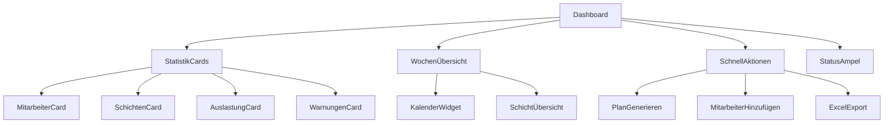
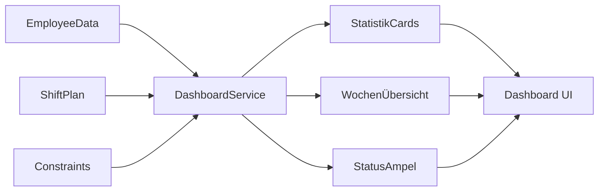

# 📊 Professionelles Dashboard-Konzept für die Dialysepraxis Schichtplanung

## 🎨 Design-System Analyse

### Bestehende Stärken:
- Material-UI Theme mit konsistenter Farbpalette (`#1976d2` Primary, `#f50057` Secondary)
- Responsive Layout mit Grid-System
- Einheitliche Komponenten-Struktur
- Gute Typografie-Hierarchie

### Verbesserungspotential:
- Erweiterte Dashboard-Widgets
- Verbesserte Datenvisualisierung
- Einheitlichere Spacing-Konzepte
- Professionellere Farbabstufungen

## 🏗️ Neues Design-System

### Erweiterte Farbpalette:
```typescript
// Primärfarben (Medizinisch/Professionell)
primary: {
  main: '#1976d2',      // Vertrauensvolles Blau
  light: '#e3f2fd',     // Heller Hintergrund
  dark: '#0d47a1',      // Dunkle Akzente
  50: '#f3f8ff',        // Sehr helle Bereiche
  100: '#dbeafe',       // Card-Hintergründe
}

// Funktionale Farben
success: '#10b981',     // Erfolgreiche Schichten
warning: '#f59e0b',     // Warnungen/Überstunden
error: '#ef4444',       // Regelverletzungen
info: '#3b82f6',        // Informationen

// Schicht-spezifische Farben
shifts: {
  early: '#10b981',     // Frühschicht (Grün)
  late: '#f59e0b',      // Spätschicht (Orange)
  special: '#8b5cf6',   // Spezialschichten (Lila)
  uetersen: '#06b6d4',  // Uetersen-Schichten (Cyan)
}
```

### Dashboard-Widget-Typen:
1. **Statistik-Cards** - KPIs und Zahlen
2. **Fortschritts-Widgets** - Monatliche Auslastung
3. **Kalender-Übersicht** - Aktuelle Woche/Monat
4. **Schnellaktionen** - Häufige Aufgaben
5. **Status-Indikatoren** - Regelverletzungen/Warnungen

## 📱 Dashboard-Layout-Konzept

```
┌─────────────────────────────────────────────────────────┐
│ Header: Dialysepraxis Dashboard + Navigation            │
├─────────────────────────────────────────────────────────┤
│ Hero-Bereich: Willkommen + Schnellaktionen             │
├─────────────────────────────────────────────────────────┤
│ ┌─────────┐ ┌─────────┐ ┌─────────┐ ┌─────────┐       │
│ │ KPI 1   │ │ KPI 2   │ │ KPI 3   │ │ KPI 4   │       │
│ │Mitarb.  │ │Schichten│ │Auslast. │ │Warnungen│       │
│ └─────────┘ └─────────┘ └─────────┘ └─────────┘       │
├─────────────────────────────────────────────────────────┤
│ ┌─────────────────────┐ ┌─────────────────────────────┐ │
│ │ Aktuelle Woche      │ │ Schnellaktionen             │ │
│ │ Schichtübersicht    │ │ • Schichtplan generieren    │ │
│ │                     │ │ • Mitarbeiter hinzufügen    │ │
│ │ [Mini-Kalender]     │ │ • Excel exportieren         │ │
│ └─────────────────────┘ └─────────────────────────────┘ │
├─────────────────────────────────────────────────────────┤
│ ┌─────────────────────────────────────────────────────┐ │
│ │ Status-Übersicht & Regelverletzungen               │ │
│ │ [Ampel-System für verschiedene Bereiche]           │ │
│ └─────────────────────────────────────────────────────┘ │
└─────────────────────────────────────────────────────────┘
```

## 🧩 Neue Dashboard-Komponenten

### 1. StatistikCard-Komponente:
```typescript
interface StatistikCardProps {
  title: string;
  value: string | number;
  subtitle?: string;
  icon: React.ReactNode;
  color: 'primary' | 'success' | 'warning' | 'error';
  trend?: {
    value: number;
    isPositive: boolean;
  };
}
```

### 2. WochenÜbersicht-Widget:
- Kompakte Darstellung der aktuellen Woche
- Farbkodierte Schichten
- Klickbare Tage für Details

### 3. SchnellAktionen-Panel:
- Häufig verwendete Funktionen
- Direkte Links zu wichtigen Bereichen
- Kontextuelle Aktionen basierend auf aktuellen Daten

### 4. StatusAmpel-System:
- Grün: Alle Regeln eingehalten
- Gelb: Warnungen vorhanden
- Rot: Regelverletzungen

## 🎯 Funktionale Dashboard-Features

### KPI-Übersicht:
1. **Mitarbeiteranzahl** (Gesamt/Aktiv)
2. **Schichtabdeckung** (Prozent des Monats geplant)
3. **Durchschnittliche Auslastung** (Stunden pro Mitarbeiter)
4. **Aktuelle Warnungen** (Anzahl Regelverletzungen)

### Interaktive Elemente:
- **Hover-Effekte** für alle Cards
- **Klickbare Bereiche** für Navigation
- **Tooltips** für zusätzliche Informationen
- **Animationen** für Datenänderungen

## 📐 Responsive Design-Strategie

### Breakpoints:
- **Mobile** (< 768px): Gestapelte Cards, vereinfachte Navigation
- **Tablet** (768px - 1024px): 2-Spalten-Layout
- **Desktop** (> 1024px): Vollständiges Dashboard-Layout

### Mobile-First Optimierungen:
- Touch-freundliche Buttons (min. 44px)
- Vereinfachte Navigation mit Drawer
- Prioritätsbasierte Inhaltsanzeige

## 🔧 Technische Implementierung

### Neue Komponenten-Struktur:
```
src/components/dashboard/
├── StatistikCard.tsx
├── WochenUebersicht.tsx
├── SchnellAktionen.tsx
├── StatusAmpel.tsx
├── DashboardGrid.tsx
└── index.ts

src/hooks/
├── useDashboardData.ts
├── useStatistiken.ts
└── useSchichtStatus.ts
```

### Erweiterte Theme-Konfiguration:
- Neue Farb-Tokens für Dashboard-Elemente
- Konsistente Spacing-Skala
- Erweiterte Schatten-System
- Verbesserte Typografie-Hierarchie

## 🎨 Visuelle Verbesserungen

### Einheitliches Styling für alle Seiten:
1. **Konsistente Header-Struktur**
2. **Einheitliche Card-Designs**
3. **Harmonische Farbverwendung**
4. **Verbesserte Tabellen-Darstellung**
5. **Professionelle Icon-Verwendung**

### Micro-Interactions:
- Sanfte Übergänge zwischen Zuständen
- Hover-Effekte für interaktive Elemente
- Loading-Animationen für Datenoperationen
- Erfolgs-Feedback für Benutzeraktionen

## 🚀 Implementierungsplan

### Phase 1: Design-System
- Erweiterte Theme-Konfiguration
- Basis-Komponenten erstellen
- Farbpalette implementieren

### Phase 2: Dashboard-Komponenten
- StatistikCard-Komponente
- WochenÜbersicht-Widget
- SchnellAktionen-Panel
- StatusAmpel-System

### Phase 3: Dashboard-Integration
- Bestehende HomePage erweitern
- Datenintegration
- Responsive Optimierungen

### Phase 4: Einheitliches Styling
- Alle Seiten überarbeiten
- Konsistente Navigation
- Finale Optimierungen

## 📊 Mermaid-Diagramme

### Komponenten-Architektur:


### Datenfluss:


## 🎯 Erfolgsmessung

### Benutzerfreundlichkeit:
- Reduzierte Klicks zu häufigen Aktionen
- Verbesserte Übersichtlichkeit
- Schnellere Informationserfassung

### Performance:
- Optimierte Ladezeiten
- Responsive Darstellung
- Smooth Animationen

### Funktionalität:
- Alle bestehenden Features erhalten
- Neue Dashboard-Funktionen
- Verbesserte Datenvisualisierung